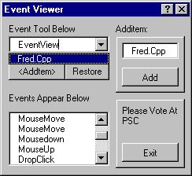



## Event viewer using Combo

### Description

view the events you did in the combo. please cote and leave comments
 
### More Info
 

             |
---                |---
**Submitted On**   |2002-07-07 15:09:30
**By**             |[CJS](https://github.com/Planet-Source-Code/PSCIndex/blob/master/ByAuthor/cjs.md)
**Level**          |Beginner
**User Rating**    |3.7 (11 globes from 3 users)
**Compatibility**  |VB 3\.0, VB 4\.0 \(16\-bit\), VB 4\.0 \(32\-bit\), VB 5\.0, VB 6\.0
**Category**       |[Coding Standards](https://github.com/Planet-Source-Code/PSCIndex/blob/master/ByCategory/coding-standards__1-43.md)
**World**          |[Visual Basic](https://github.com/Planet-Source-Code/PSCIndex/blob/master/ByWorld/visual-basic.md)
**Archive File**   |[Event\_view103190772002\.zip](https://github.com/Planet-Source-Code/cjs-event-viewer-using-combo__1-36687/archive/master.zip)

